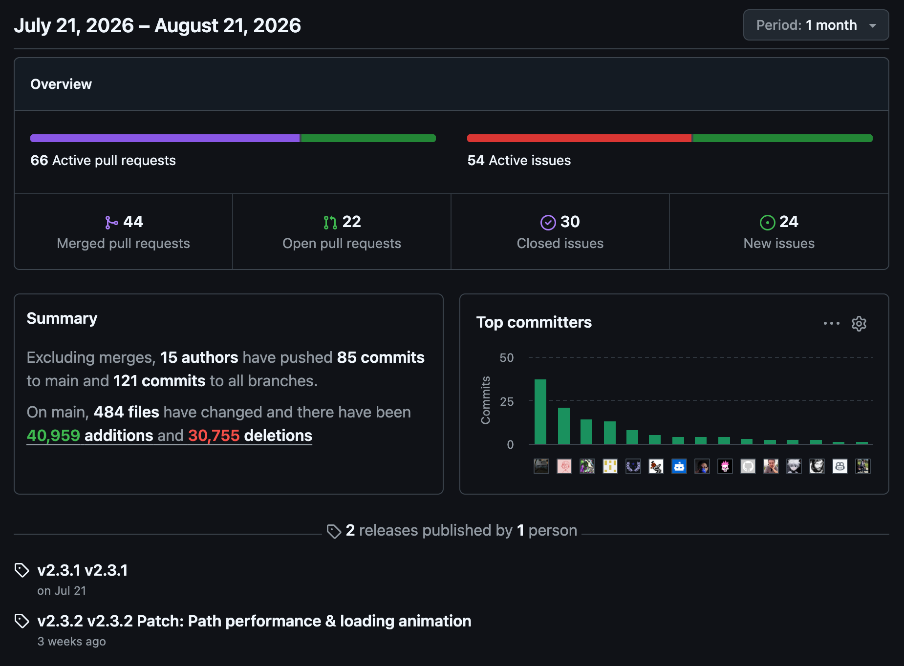

# Open Source Health Metrics

!!! mascot-welcome "Time to color outside the loops!"
    { class="mascot-admonition-img" }
    Welcome to the world of open source! We're going to dive into how to read a project's vital signs so you can find the best communities to learn from. Let's blend some code and learn how to measure the health of a repository!

Today (summer of 2026), p5.js is an open source project that is actively maintained with new versions and features being rolled out continually. But just like any other open source project, there are no guarantees this will be true forever.

This appendix is a guide to show you how to assess the overall health of the current p5.js project and tools to monitor its health in the future. GitHub provides a powerful set of tools—specifically the **Insights** panel—that can help you understand how active, welcoming, and well-maintained a project is.

## The GitHub Insights Panel

The Insights panel is the control room for viewing the activity of a repository. It provides graphs and statistics about code frequency, dependency graphs, community standards, and contributor activity. To find it, navigate to any repository on GitHub and click the **Insights** tab near the top of the page.

While the Insights panel provides a wealth of data, focusing on a few key measurements gives you the quickest and most accurate picture of a project's vitality.

## Key Health Measurements

### 1. Number of Stars

Stars are the open source equivalent of a "like" or a "bookmark." While they don't necessarily measure code quality, they are a strong indicator of a project's popularity and reach.
*   **What it means:** A high star count suggests a large user base, which usually translates to better community support, more tutorials, and a higher likelihood of the project being maintained long-term.
*   **What to look for:** Steady growth over time. A project with 10,000 stars that hasn't grown in three years might be abandoned, whereas a project with 500 stars growing rapidly is highly active.

### 2. Open Issues

The "Issues" tab is where users report bugs, request features, and ask for help.
*   **What it means:** Issues are a sign of life! It means people are actively using the software and caring enough to provide feedback.
*   **What to look for:** Look at how maintainers interact with open issues. Are issues being triaged and labeled? Are there respectful discussions? A massive graveyard of thousands of ignored, open issues can be a red flag that the maintainers are overwhelmed or absent.

!!! mascot-thinking "Consider the Ratio"
    { class="mascot-admonition-img" }
    A high number of open issues isn't always a bad thing! Think about it like this: a popular project will naturally have more users reporting bugs. What really matters is how many issues are being actively discussed and resolved compared to those left abandoned.

### 3. Pull Requests (PRs) Not Merged into Base

Pull Requests are proposed changes to the code submitted by contributors. Unmerged (or "open") PRs are those waiting for review.
*   **What it means:** Open PRs indicate that the community is actively trying to improve the project by writing code.
*   **What to look for:** The time it takes for PRs to be reviewed and either merged or closed. If there are hundreds of PRs that have been open for years without any comments from the maintainers, it suggests a bottleneck. A healthy project will have a steady churn of PRs being opened, reviewed, and merged into the base branch.

!!! mascot-tip "Check the Pulse"
    { class="mascot-admonition-img" }
    Want to save some time? Check the "Pulse" section under the Insights tab. It gives you a quick snapshot of how many PRs were merged and issues were closed over the last week or month, providing an instant summary of recent activity!

## Case Study: The Health of p5.js

Let's apply these metrics to our favorite creative coding library, **p5.js**. By examining the [processing/p5.js repository on GitHub](https://github.com/processing/p5.js/), we can determine its current health.

*   **Stars:** With over **23,800 stars**, p5.js boasts massive popularity. This indicates a robust, global community of artists, educators, and developers relying on the library.
*   **Open Issues:** There are roughly **514 open issues**. For a project used by hundreds of thousands of people, this is a very manageable number. Browsing the issues reveals active discussions, prompt triage by maintainers, and community-driven problem solving.
*   **Unmerged Pull Requests:** There are currently around **129 open PRs**. This shows that the community is actively submitting new features and bug fixes. More importantly, the maintainers are actively reviewing these submissions, merging good code, and providing feedback to contributors.

### Watching the p5.js GitHub Repo Statistics

GitHub provides an "Insights" dashboard that quickly summarizes the status of the repository, available at: [https://github.com/processing/p5.js/pulse](https://github.com/processing/p5.js/pulse).

### p5.js Health Score: 92 / 100

Based on these metrics, p5.js earns an excellent general health score of **92 out of 100**. 

The community is highly engaged, contributions are actively reviewed, and the project is continuously evolving. The remaining 8 points account for the natural bottlenecks and open issue backlog that any large, volunteer-driven open source project inevitably faces. Overall, it is a thriving, welcoming ecosystem.

!!! mascot-celebration "Incredible work!"
    { class="mascot-admonition-img" }
    You just mastered how to evaluate open source project health! Now you can confidently navigate GitHub and find the perfect creative communities to join.