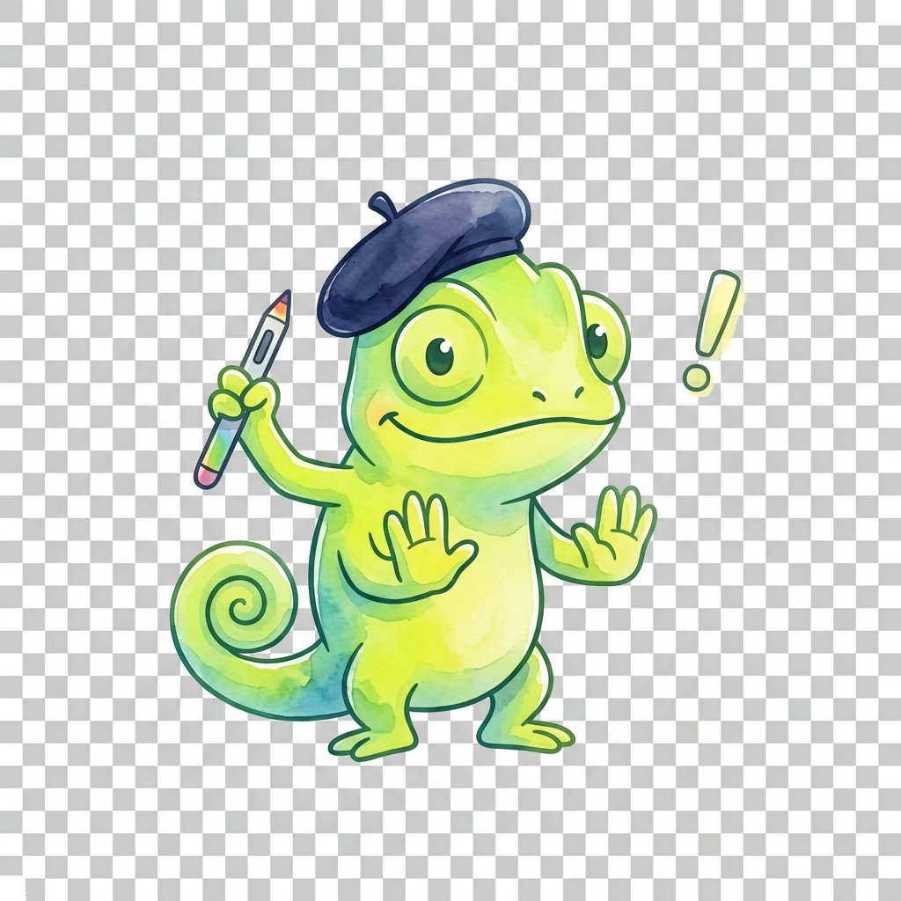

# Microphone Input & FFT Spectral Analysis

## Summary

Captures live microphone input (p5.AudioIn), amplitude tracking, Fast Fourier Transform (p5.FFT) frequency bins, and beat detection. Students will gain practical hands-on experience by building interactive sketches and visual experiments that demonstrate these concepts.

## Concepts Covered

This chapter covers the following 34 concepts from the learning graph:

1. p5 AudioIn Microphone
2. Microphone Start Input
3. Microphone Stop Input
4. Microphone Get Level
5. p5 Amplitude Class
6. Amplitude Get Level
7. Smooth Amplitude Level
8. p5 FFT Class Concept
9. FFT Analyze Spectrum
10. FFT Frequency Bins Array
11. FFT Get Energy Bass
12. FFT Get Energy LowMid
13. FFT Get Energy Mid
14. FFT Get Energy HighMid
15. FFT Get Energy Treble
16. FFT Waveform Time Domain
17. Spectrum Frequency Chart
18. Circular Audio Visualizer
19. Beat Detection Threshold
20. Beat Detection Energy Peak
21. Audio Reactive Pulse Scale
22. Audio Reactive Color Shift
23. Particle Burst on Beat
24. Fast Fourier Transform Math
25. Audio Spectrogram Plot
26. Audio Pitch Detection
27. Frequency Centroid Math
28. Logarithmic Frequency Scale
29. Octave Band Splitting
30. Audio Input Peak Hold
31. Audio Visual EQ Bars
32. 3D Audio Reactive Visual
33. Microphone Feedback Gate
34. Acoustic Signal Processing

## Prerequisites

This chapter builds on concepts from:

- [Chapter 21: Audio Synthesis, Oscillators & Envelopes](../21-audio-synthesis-sound/index.md)

---

!!! mascot-welcome "Sound Becomes Color!"
    { class="mascot-admonition-img" }

    Welcome back, creators! Have you ever wanted to see what music actually looks like? This chapter will teach you how to analyze real-time sound and transform it into jaw-dropping visual equalizers and responsive art. Time to color outside the loops and see the music!

When you look at a rainbow, you are seeing a prism split white light into its component colors. The prism reveals the hidden spectrum of light. What if we could do the same for sound? In this chapter, we will build digital prisms and oscilloscopes to visualize the hidden world of sound waves. 

## Introduction: The Oscilloscope and the Prism

The oscilloscope represents the time domain: it shows how the volume of a sound changes over time, graphing pressure variations as a continuous wave. The prism represents the frequency domain: it splits a complex sound into its individual pitches, showing us how much bass, mid, and treble energy is present.

To capture the raw sound, we use a **p5 AudioIn Microphone**. This acts as our ear, capturing the physical vibrations of the air and converting them into electrical signals. But the signal alone is just a stream of numbers. We need algorithms like the **Fast Fourier Transform Math** to make sense of it.

## Setting up the Microphone

Before we can visualize sound, we must let the code listen to our environment. In p5.js, we initiate a **Microphone Start Input** command to request access to the user's audio device. It is good practice to provide a toggle button so the user can use the **Microphone Stop Input** when they are done.

```javascript
let mic;

function setup() {
  createCanvas(400, 400);
  
  // Create an Audio input
  mic = new p5.AudioIn();
  
  // start the Audio Input
  mic.start();
}

function draw() {
  background(200);
  
  // Get the overall volume (between 0 and 1.0)
  let vol = mic.getLevel();
  
  fill(127);
  stroke(0);
  
  // Draw an ellipse with size based on volume
  let h = map(vol, 0, 1, height, 0);
  ellipse(width/2, h - 25, 50, 50);
}
```

### Amplitude Tracking

While the microphone captures the raw audio, we often just want to know how loud it is overall. We can use a **p5 Amplitude Class** to track the overall volume. By calling **Amplitude Get Level**, we receive a value between 0.0 and 1.0 representing the volume. However, raw amplitude changes very rapidly, causing our visuals to flicker erratically. To fix this, we apply a **Smooth Amplitude Level** technique, interpolating between the current and previous volume levels for a buttery-smooth visual response. Alternatively, you can use the **Microphone Get Level** method directly if you just need the microphone's immediate amplitude.

!!! mascot-tip "Smoothing is Key!"
    { class="mascot-admonition-img" }
    Here's a secret for buttery visuals: raw microphone data flickers way too fast. Wrap your volume variable in `lerp(currentVol, targetVol, 0.1)` to smoothly glide between values and create a **Smooth Amplitude Level**. Your users' eyes will thank you!

## The Prism: Fast Fourier Transform (FFT)

Now we move from the oscilloscope to the prism. The **p5 FFT Class Concept** introduces the Fast Fourier Transform, a powerful algorithm that analyzes a sound wave and separates it into its individual frequencies. By calling **FFT Analyze Spectrum**, the algorithm returns a **FFT Frequency Bins Array**, typically containing 1024 values representing the volume at different frequency bands.

With this array, we can ask for the energy in specific frequency ranges.

!!! mascot-thinking "Unbaking the Cake"
    { class="mascot-admonition-img" }
    Think about it like this: an oscilloscope shows you *when* a sound is loud, but the Fast Fourier Transform shows you *what* the sound is made of. It's like a magical algorithm that unbakes a cake to tell you exactly how many cups of bass, mid, and treble went into it! 
- **FFT Get Energy Bass** (low frequencies, like a kick drum)
- **FFT Get Energy LowMid** (cellos and deep voices)
- **FFT Get Energy Mid** (standard vocals and guitars)
- **FFT Get Energy HighMid** (snares and synthesizers)
- **FFT Get Energy Treble** (cymbals and high hats)

Here is how you might extract these energies:

```javascript
let fft;

function setup() {
  createCanvas(400, 400);
  mic = new p5.AudioIn();
  mic.start();
  
  fft = new p5.FFT();
  fft.setInput(mic);
}

function draw() {
  background(0);
  let spectrum = fft.analyze();
  
  let bass = fft.getEnergy("bass");
  let lowMid = fft.getEnergy("lowMid");
  let mid = fft.getEnergy("mid");
  let highMid = fft.getEnergy("highMid");
  let treble = fft.getEnergy("treble");
  
  // Visualize the energies
  // ...
}
```

#### Diagram: Spectrum Analyzer

<details markdown="1">
<summary>MicroSim: Spectrum Analyzer</summary><summary>MicroSim: Spectrum Analyzer</summary>
- Uses `p5.FFT` to display a live **Spectrum Frequency Chart**.
- Shows 5 large bars representing Bass, LowMid, Mid, HighMid, and Treble.
- Includes a toggle to switch to a detailed view of the full **FFT Frequency Bins Array**.
- Sliders to adjust the **Smooth Amplitude Level**.
</details>

### Visualizing the Data

With the FFT data, we can create a classic **Spectrum Frequency Chart** or **Audio Visual EQ Bars**. We can plot the energies in a bar graph, where the height of each bar corresponds to the energy in that frequency band.

Another popular visualization is the **Circular Audio Visualizer**. Instead of drawing bars in a straight line, we map the frequency bins to a circle using trigonometry (`sin` and `cos`). This creates a dynamic, flower-like shape that expands and contracts with the music. 

We can also view the sound in the time domain using the **FFT Waveform Time Domain** method, which returns an array of amplitude values over a small time window. This is our digital oscilloscope.

## Beat Detection

A common feature in audio visualization is reacting to the "beat" or tempo of the music. To achieve this, we need a **Beat Detection Threshold**. When the energy in a specific frequency band (like the bass) exceeds this threshold, we register a beat. 

However, a static threshold isn't enough, because a loud song will constantly trigger it. We need a dynamic threshold that tracks the **Beat Detection Energy Peak** and slowly decays. This is often called an **Audio Input Peak Hold** algorithm.

When a beat is detected, we can trigger exciting visual effects:
- **Audio Reactive Pulse Scale**: A shape suddenly grows larger on the beat and slowly shrinks.
- **Audio Reactive Color Shift**: The color palette radically changes when a kick drum hits.
- **Particle Burst on Beat**: A system of particles explodes outward.

```javascript
let beatThreshold = 150;
let beatDecay = 0.95;

function detectBeat(bassEnergy) {
  if (bassEnergy > beatThreshold) {
    // Beat detected!
    triggerPulse();
    triggerColorShift();
    triggerParticles();
    
    // Bump the threshold up so it doesn't immediately trigger again
    beatThreshold = bassEnergy * 1.1; 
  }
  // Decay the threshold slowly
  beatThreshold *= beatDecay;
  beatThreshold = max(beatThreshold, 100); // Minimum threshold
}
```

#### Diagram: Beat Detector System

<details markdown="1">
<summary>MicroSim: Beat Detector System</summary><summary>MicroSim: Beat Detector System</summary>
- A live audio-reactive scene with a central pulsing circle.
- The circle demonstrates **Audio Reactive Pulse Scale** and **Audio Reactive Color Shift**.
- On beat, it creates a **Particle Burst on Beat**.
- UI controls to manually adjust the **Beat Detection Threshold** and observe the **Beat Detection Energy Peak**.
</details>

## Advanced Topics

As you explore deeper into **Acoustic Signal Processing**, you will encounter more complex techniques.

### Pitch and Centroid
While FFT tells us the energy across many frequencies, sometimes we just want to know the single dominant pitch. **Audio Pitch Detection** algorithms analyze the waveform to find the fundamental frequency. A simpler metric is the **Frequency Centroid Math**, which calculates the "center of mass" of the spectrum. A bright, tinny sound has a high centroid, while a dark, muffled sound has a low centroid.

### Logarithmic Scales and Spectrograms
Human hearing is not linear. We hear pitch logarithmically. The distance from 100Hz to 200Hz is one octave, but the distance from 1000Hz to 2000Hz is also one octave. To make our visualizers look natural, we often use a **Logarithmic Frequency Scale** and perform **Octave Band Splitting** to group frequencies the way our ears perceive them.

We can also visualize sound over a longer period using an **Audio Spectrogram Plot**. A spectrogram plots time on the X-axis, frequency on the Y-axis, and amplitude as color intensity. This is widely used in speech analysis and ornithology (studying bird songs).

### Handling Feedback
When working with live microphones and speakers simultaneously, you might experience a loud squealing noise. This is acoustic feedback, where the microphone picks up the speaker output, amplifies it, and plays it back in a loop. To prevent this, professional systems use a **Microphone Feedback Gate** (or noise gate) to mute the mic when the volume drops below a certain level.

!!! mascot-warning "Beware the Squeal!"
    { class="mascot-admonition-img" }
    Watch out for the infinite feedback loop! If your microphone hears your speakers, it will amplify the sound until it creates a deafening screech. To avoid blasting your ears, always wear headphones while coding audio-reactive sketches!

### Entering the Third Dimension
Finally, we can map our FFT data to 3D space using WEBGL. A **3D Audio Reactive Visual** might use the bass energy to deform a 3D sphere, or map the spectrum across a flowing 3D terrain grid, creating a mesmerizing synthetic landscape that dances to the music.

## Deep Dive: The Mathematics of Sound

To truly understand how our digital prism works, we must briefly explore the underlying mathematics. The Fast Fourier Transform (FFT) is an incredibly efficient algorithm for computing the Discrete Fourier Transform (DFT). The DFT takes a discrete signal in the time domain (our audio samples) and transforms it into the frequency domain. 

The core idea, formulated by Jean-Baptiste Joseph Fourier in the 19th century, is that any complex periodic wave can be constructed by adding together a series of simple sine and cosine waves of varying frequencies and amplitudes. When we call the analyze method on our FFT object, the algorithm is essentially working backwards: it takes the complex, chaotic wave recorded by the microphone and calculates the exact recipe of simple sine waves needed to recreate it.

!!! mascot-encourage "Breathe and Trust the Math"
    { class="mascot-admonition-img" }
    If the calculus behind the Fast Fourier Transform feels overwhelming, that's completely normal! You don't need to manually calculate sine wave interference to be an artist. Just trust `p5.FFT` to hand you the frequencies, and focus on the beautiful visuals you can paint with them.

### The Anatomy of an Audio Buffer

When the microphone captures sound, it doesn't process continuous analog signals; rather, it takes discrete snapshots of the air pressure thousands of times per second. This rate is known as the sampling rate. A standard CD-quality audio file has a sampling rate of 44,100 Hz, meaning the microphone takes 44,100 snapshots every single second.

These snapshots are stored in an array known as a buffer. When we request the waveform using our time domain function, p5.js returns an array containing a small segment of this buffer—typically 1024 samples. Each value in this array represents the normalized amplitude of the sound wave at that exact fraction of a second, ranging from -1.0 to 1.0. 

By iterating through this array and mapping the values to the Y-axis of our canvas while mapping the array index to the X-axis, we can draw the actual shape of the sound wave. This is precisely how an oscilloscope works, painting the invisible pressure variations onto a glowing screen.

```javascript
// Example of drawing a waveform oscilloscope
function drawWaveform() {
  let waveform = fft.waveform(); // Returns an array of 1024 values
  noFill();
  beginShape();
  stroke(255, 50, 50);
  strokeWeight(2);
  
  for (let i = 0; i < waveform.length; i++){
    let x = map(i, 0, waveform.length, 0, width);
    let y = map(waveform[i], -1, 1, height, 0);
    vertex(x, y);
  }
  endShape();
}
```

### Advanced Spectrogram Generation

A spectrogram provides a historical record of the frequency spectrum over time. To build an audio spectrogram plot, we need to continuously sample the FFT spectrum and draw it to the screen. However, instead of drawing bars, we map the energy of each frequency bin to a color or grayscale value, and draw a single vertical line of pixels for that moment in time.

As time progresses, we shift the entire image to the left (or scroll it downwards) and draw the new frequency data on the right edge. This creates a scrolling waterfall of color that reveals the intricate structure of complex sounds, such as spoken words or musical chords. The X-axis represents time, the Y-axis represents frequency (often using a logarithmic scale for better low-frequency resolution), and the color intensity represents the amplitude of that specific frequency band.

This technique is not just for making pretty visuals; it is a fundamental tool in acoustic signal processing, used by engineers to analyze room acoustics, by linguists to study phonetics, and by musicians to tune their instruments.

### Fine-Tuning the Visual Experience

When designing interactive audio experiences, developers must consider the user experience and hardware limitations. The visual frame rate of a web browser typically caps at 60 frames per second, while audio is processed at thousands of samples per second. This mismatch means that our visuals are essentially sampling the audio data at a much lower rate.

To prevent our visuals from appearing jittery or disjointed, we rely heavily on interpolation and smoothing techniques. When mapping an audio reactive pulse scale to a shape, for example, we don't apply the raw amplitude directly to the scale factor. Instead, we use linear interpolation to smoothly transition the current scale towards the target scale defined by the audio energy. This gives the visual a sense of physical mass and inertia, making it feel more organic and responsive.

Furthermore, when dealing with dynamic ranges, it is often necessary to apply mathematical functions like logarithms or power curves to the raw data. Human perception of loudness is logarithmic; an increase in acoustic power by a factor of ten is perceived as roughly twice as loud. Therefore, simply mapping the linear amplitude to the size of a circle may not look accurate to the viewer. Applying a curve to the data ensures that the visual representation matches the human sensory experience.

By combining these mathematical principles, careful data structuring, and a strong aesthetic vision, developers can create truly immersive and responsive interactive art. The combination of the microphone as an ear, the FFT as a prism, and the canvas as a stage allows us to bridge the gap between the auditory and visual domains, revealing the hidden beauty of the acoustic world.

### Understanding Windowing Functions in FFT

When the Fast Fourier Transform operates on an audio buffer, it inherently assumes that the small chunk of data it is analyzing is a single period of an infinitely repeating waveform. However, in reality, we are just chopping an arbitrary slice out of a continuous audio stream. This sudden chopping creates sharp discontinuities at the beginning and end of the buffer.

If the algorithm processes these sharp edges directly, it introduces artificial high-frequency noise into the spectrum, a phenomenon known as spectral leakage. To mitigate this, engineers apply a mathematical technique called windowing. A windowing function gradually fades the audio signal in at the start of the buffer and fades it out at the end, smoothly tapering the edges down to zero.

Common windowing functions include the Hamming, Hanning, and Blackman windows. Each offers a different trade-off between frequency resolution (how well we can distinguish between two closely spaced pitches) and amplitude accuracy (how accurately we can measure the energy of a given pitch). In p5.js, a default windowing function is applied behind the scenes when you instantiate the FFT object, ensuring that the resulting frequency bins provide a clean and accurate representation of the sound without requiring manual intervention from the developer.

### The Challenge of Pitch Detection

While identifying the dominant frequencies is straightforward with FFT, extracting the exact musical pitch is surprisingly difficult. A musical note played on an instrument is rarely a pure sine wave. Instead, it consists of a fundamental frequency (which determines the perceived pitch) and a series of harmonic overtones (which determine the timbre, or tone color, of the instrument).

Sometimes, the fundamental frequency might actually have less energy than its overtones, tricking simple algorithms into misidentifying the pitch. Advanced pitch detection algorithms, such as the YIN algorithm or autocorrelation methods, do not just look for the highest peak in the frequency spectrum. Instead, they analyze the waveform in the time domain, looking for repeating patterns and calculating the exact time difference between these repetitions.

By measuring the period of the repeating pattern, the algorithm can calculate the true fundamental frequency with high precision, even if the overtones are louder. This level of accuracy is essential for building applications like digital guitar tuners or interactive vocal training software, where knowing the precise musical note is critical.

### Spatial Audio and 3D Visualization

As web technologies have evolved, the integration of 3D graphics via WebGL and spatial audio via the Web Audio API has opened up new frontiers for creative coders. Imagine not just drawing a 2D spectrum on the screen, but positioning sound sources in a 3D virtual environment.

When an audio source is spatialized, the browser automatically calculates the volume, panning, and even the Doppler effect based on the listener's position relative to the sound. By linking this spatial audio data with 3D graphics, developers can create immersive experiences where shapes react differently depending on where the sound is coming from.

For instance, a cluster of 3D cubes on the left side of the screen might pulsate only when low frequencies are detected from a left-panned audio channel, while a particle system on the right explodes in response to high-frequency transients from a right-panned channel. This synthesis of spatial audio and 3D rendering creates a deeply engaging, multi-sensory environment that pushes the boundaries of what is possible in the browser.

By mastering the tools presented in this chapter—from the simple act of requesting microphone access to the complex mathematics of the Fast Fourier Transform—you are acquiring the fundamental skills necessary to build these advanced interactive systems. The journey from a basic bouncing ball to a fully realized, audio-reactive 3D landscape begins with a solid understanding of how digital audio is captured, analyzed, and visualized.

## Expanding Our Sonic Palette

To truly master these concepts, we must look beyond the immediate algorithms and consider the broader context of creative coding. Sound is a physical medium, and our digital tools are merely translations of that physical reality into numbers. When you use an `AudioIn` object, you are opening a portal between the physical vibration of the speaker's vocal cords and the glowing pixels of your monitor.

### Crafting a Sensory Experience

A great visualizer does not just blindly map data to shapes; it creates a synesthetic experience. Synesthesia is a perceptual phenomenon where stimulation of one sensory or cognitive pathway leads to involuntary experiences in a second sensory or cognitive pathway. In our context, we are artificially constructing a synesthetic experience for the user.

When the bass drops in a song, the visualizer shouldn't just change a number; the entire screen should feel the impact. This is where concepts like screen shake, color inversion, and particle physics come into play. By combining the rigid mathematical output of the FFT with organic physics simulations, we bridge the gap between sterile data and visceral art.

### Optimization and Performance Tuning

As your visualizers become more complex, especially when moving into 3D, performance becomes a critical concern. JavaScript is a single-threaded language, meaning all your calculations, audio processing, and rendering must happen in a tight sequence 60 times a second. If your code takes too long to execute, the animation will stutter, and the illusion is broken.

To optimize, avoid creating new objects or arrays inside the `draw` loop. Instead, allocate your arrays in the `setup` function and reuse them. Furthermore, consider how many geometric shapes you are drawing. Drawing 1024 individual rectangles for every frequency bin might be visually impressive, but it is computationally expensive. Often, averaging groups of bins together—a process sometimes referred to as downsampling or creating a low-resolution representation—can result in a smoother performance and a cleaner, more readable visual aesthetic.

### Bridging Sound and Light

Let us consider one final, advanced example. Imagine we want to build a visualizer that doesn't just react to the music, but feels like an integral part of it. To do this, we need to map the characteristics of sound to the characteristics of light. Pitch can map to hue, amplitude to brightness, and timbre (the complexity of the spectrum) to saturation or physical texture.

If we apply a Fast Fourier Transform and find a high concentration of energy in the treble, we might shift the global palette towards bright blues and whites, triggering sharp, geometric shapes. If the energy sits in the bass, we might shift towards deep reds and oranges, using soft, rounded, slowly pulsing organic shapes. We can extract the Frequency Centroid Math to determine this overall color temperature of the sound. This level of nuanced mapping elevates our project from a simple audio visualizer to an interactive, algorithmic instrument. 

!!! mascot-celebration "Awesome Work!"
    { class="mascot-admonition-img" }
    Incredible work! You just mastered capturing real-time `p5.AudioIn` data, extracting frequency bins with the Fast Fourier Transform, and building dynamic beat detection algorithms!
