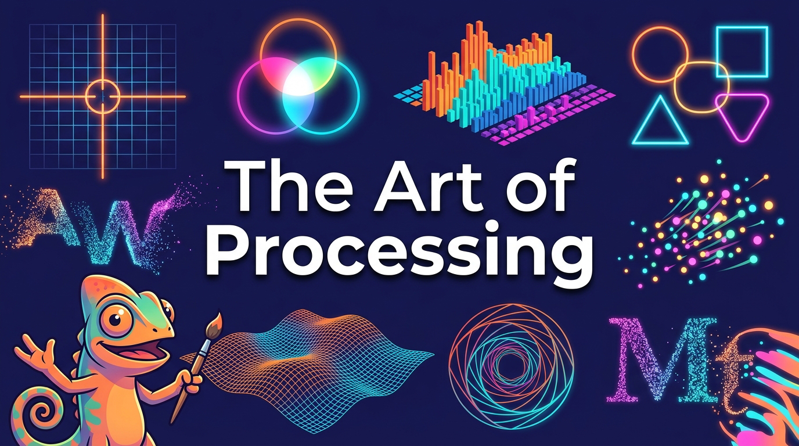

# The Art of Processing

<figure markdown>
  { width="100%" }
</figure>

Welcome to **The Art of Processing: Creative Coding, Computational Thinking, and Interactive Media with p5.js**.

This comprehensive, expansive intelligent textbook bridges the gap between creative visual artistic expression and rigorous computer science principles. Utilizing **p5.js**—the modern JavaScript implementation of Processing—this course transforms abstract computational concepts into immediate, visual, and acoustic feedback. Master core programming constructs while building interactive artwork, physics simulations, generative typography, and audio-reactive visualizers.

## Who This Book Is For

1. **Students & Self-Directed Learners:** Beginners to intermediate programmers learning computational thinking, interactive graphics, and generative art. No programming experience required.
2. **Educators, Instructors, Mentors & Volunteers:** K-12 teachers, bootcamp instructors, and volunteer coding mentors seeking structured pedagogy, live-coding strategies, and scaffolding techniques for creative coding.

## How to Use This Book

Use the navigation menu to explore:

- **[Chapters](chapters/01-intro-creative-coding/index.md)** - Main educational content
- **[Learning Graph](learning-graph/index.md)** - Interactive concept visualization
- **[MicroSims](sims/index.md)** - Interactive simulations for hands-on learning
- **[Glossary](glossary.md)** - Key terms and definitions
- **[FAQ](faq.md)** - Frequently asked questions
- **[Teacher's Guide](teachers-guide/index.md)** - Strategies and plans for educators
- **[About](about.md)** - Information about the book and authors
- **[Appendices](appendices/index.md)** - Supplementary material and resources
- **Search** - Use the search bar (or press `s` / `/`) to quickly find specific topics across the entire book

## Getting Started

Start with [Chapter 1: Introduction to Creative Coding & Canvas Foundations](chapters/01-intro-creative-coding/index.md) to begin your learning journey.
