# List of MicroSims for The Art of Processing

Interactive Micro Simulations to help students learn the art of processing fundamentals.

-   **[3D Scene Editor](./3d-scene-editor/index.md)**

    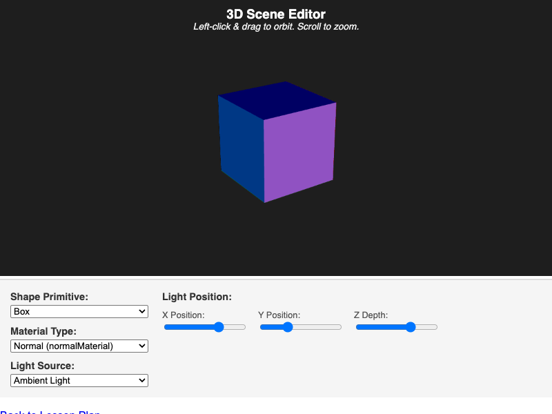

    Interactive p5.js MicroSim for 3d scene editor.

-   **[Additive Color Mixer](./additive-color-mixer/index.md)**

    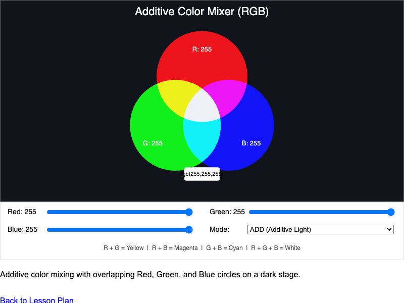

    Explore RGB additive color mixing with overlapping spotlights, channel sliders, and Venn intersection analysis.

-   **[Algorithm Visualizer](./algorithm-visualizer/index.md)**

    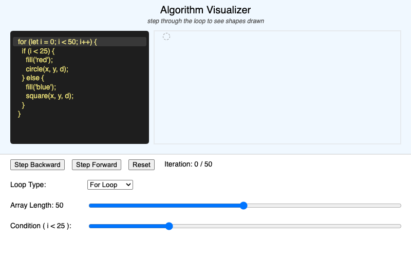

    Interactive p5.js MicroSim demonstrating control flow, loops, and conditional branching.

-   **[Arc and Angle Explorer](./arc-angle-explorer/index.md)**

    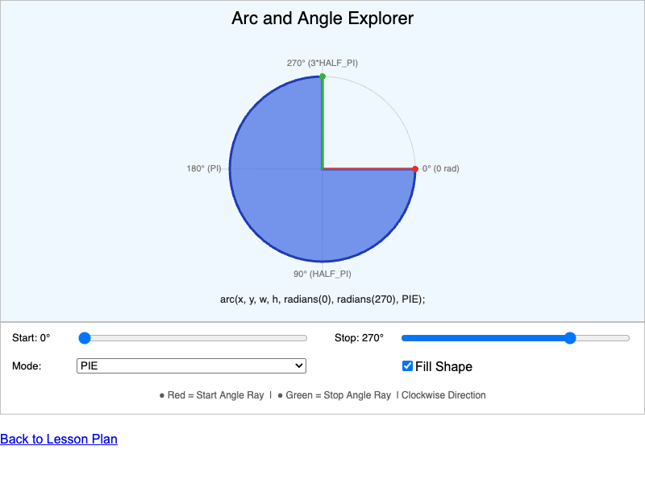

    Visualize p5.js arc drawing modes (OPEN, CHORD, PIE) with interactive start and stop angles in degrees and radians.

-   **[Array Methods Visualizer](./array-methods-visualizer/index.md)**

    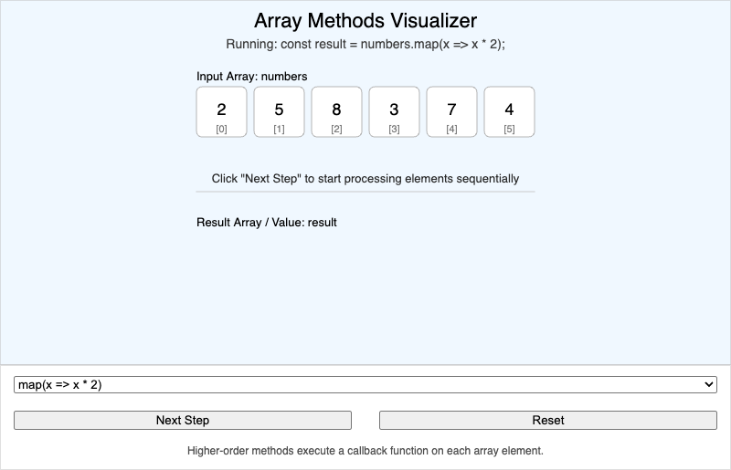

    Interactively step through functional array methods including map(), filter(), reduce(), and find() with visual memory transformations.

-   **[Async Data Fetcher](./async-data-fetcher/index.md)**

    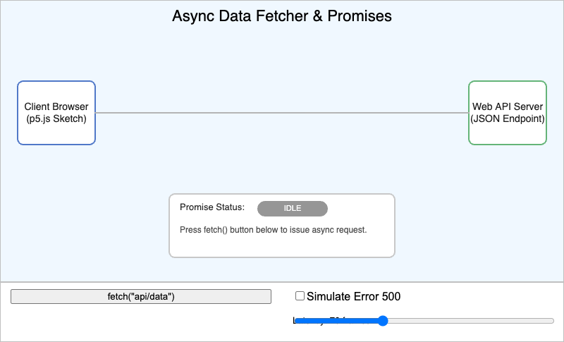

    Visualize JavaScript asynchronous fetch(), Promise lifecycle states (Pending, Fulfilled, Rejected), and network packet transit.

-   **[Audio Visualizer Lab](./audio-visualizer-lab/index.md)**

    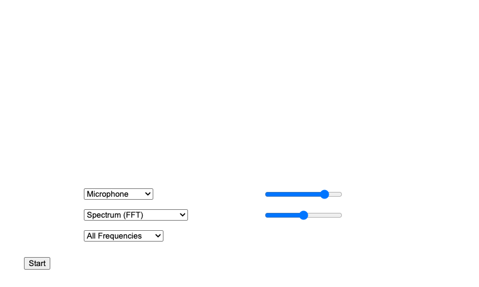

    Interactive p5.js MicroSim for audio visualizer lab.

-   **[Beat Detector System](./beat-detector-system/index.md)**

    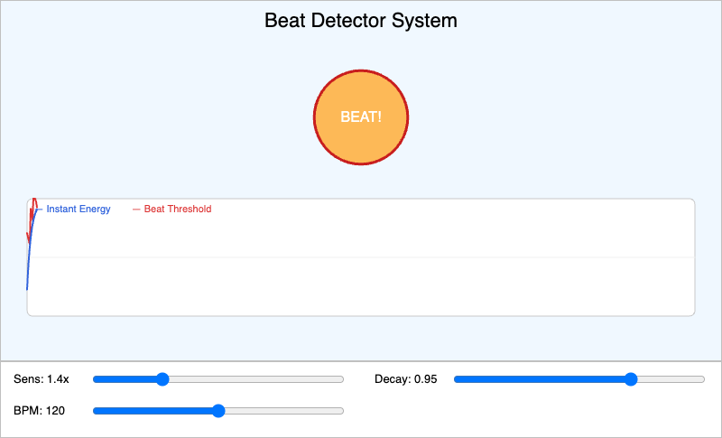

    Simulate real-time audio FFT beat detection with dynamic thresholding, energy accumulation, and visual beat triggers.

-   **[Bézier Control Point Sandbox](./bezier-sandbox/index.md)**

    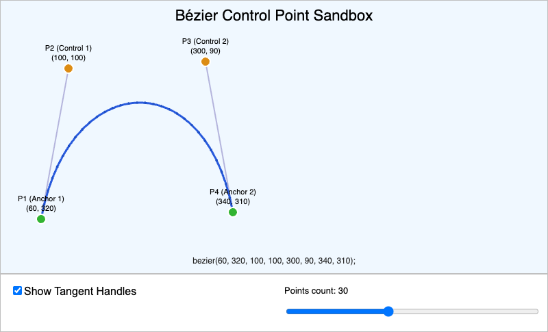

    Interactive cubic Bézier curve with 4 draggable anchor and control points, tangent guide lines, and p5.js bezier() code generator.

-   **[Canvas Inspector](./canvas-inspector/index.md)**

    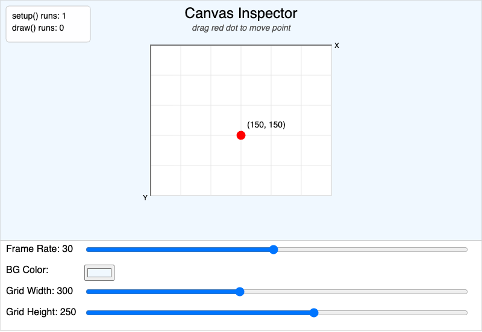

    Interactive p5.js MicroSim for canvas inspector.

-   **[Color Mixer](./color-mixer/index.md)**

    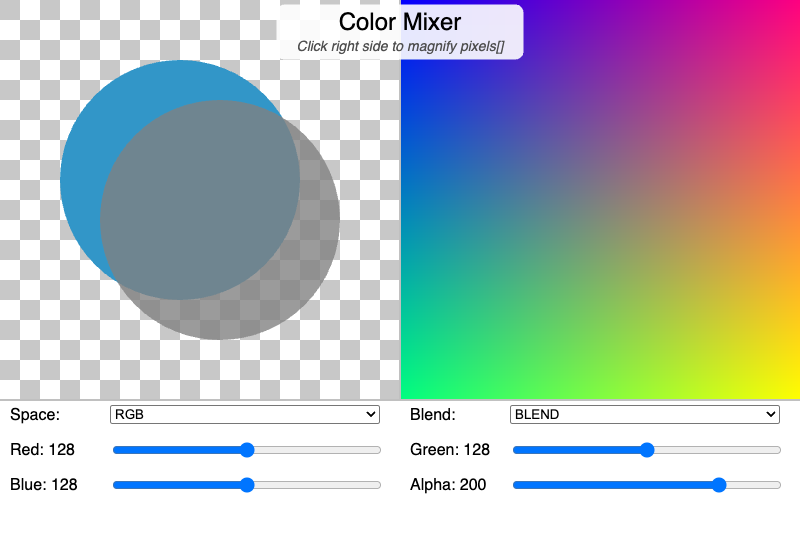

    Interactive p5.js MicroSim for color mixer.

-   **[Coordinate System Explorer](./coordinate-system-explorer/index.md)**

    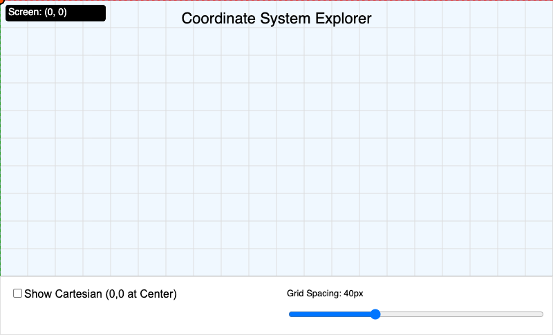

    Compare computer graphics canvas coordinates (origin at top-left, Y downwards) with traditional Cartesian coordinates.

-   **[CORS Blockage Visualization](./cors-blockage-visualization/index.md)**

    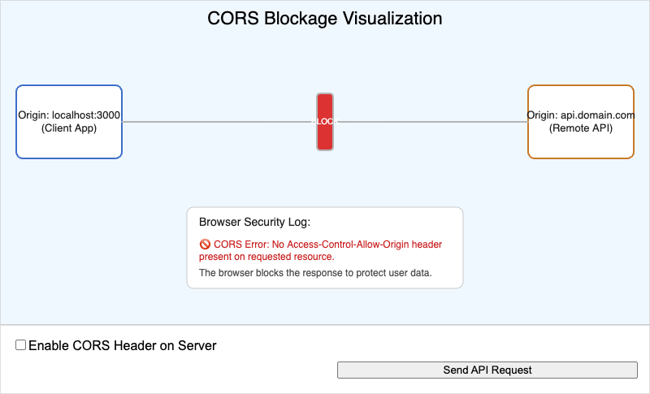

    Demonstrate Cross-Origin Resource Sharing (CORS) security mechanisms, origin headers, and preflight OPTIONS checks.

-   **[Data Flow Debugger](./data-flow-debugger/index.md)**

    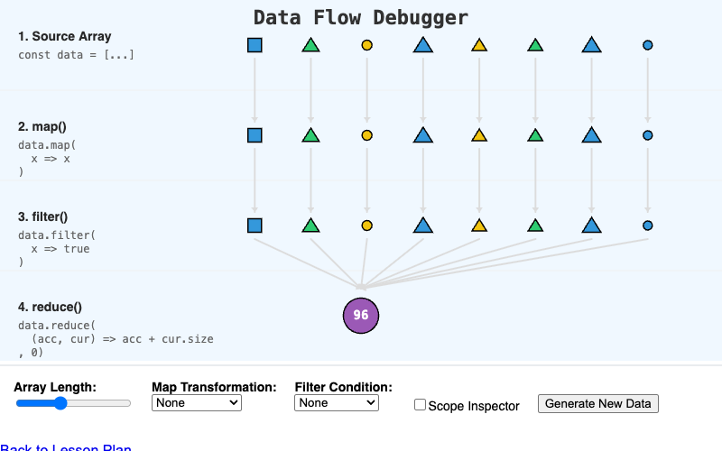

    Interactive p5.js MicroSim for data flow debugger.

-   **[Dev Environment Simulator](./dev-environment-simulator/index.md)**

    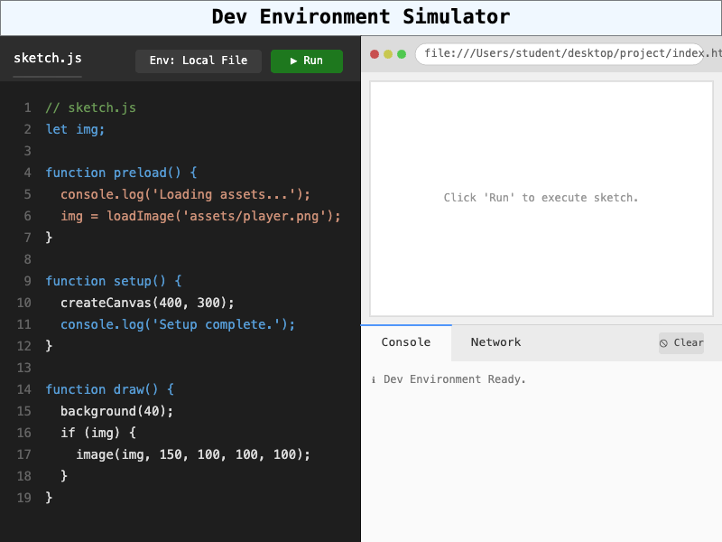

    Interactive p5.js MicroSim for dev environment simulator.

-   **[Device Orientation Maze](./device-orientation-maze/index.md)**

    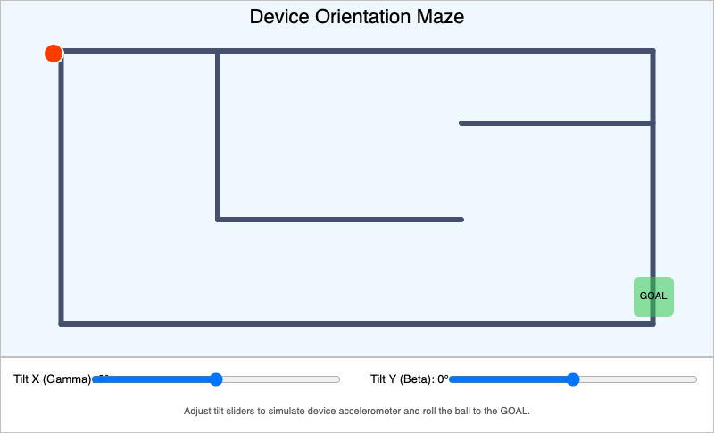

    Simulate smartphone tilt sensors (Alpha, Beta, Gamma rotation angles) to navigate a rolling ball through a physical maze.

-   **[DOM Layout Explorer](./dom-layout-explorer/index.md)**

    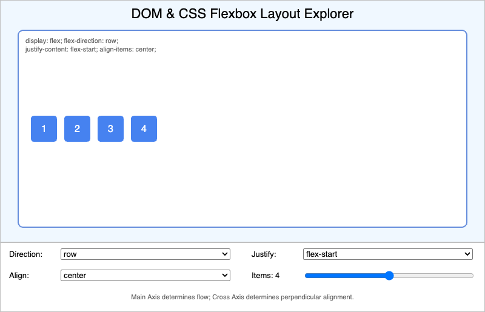

    Interactive CSS Flexbox and Grid layout visualizer exploring justify-content, align-items, flex-direction, and responsive flow.

-   **[Exploring Shaders](./exploring-shaders/index.md)**

    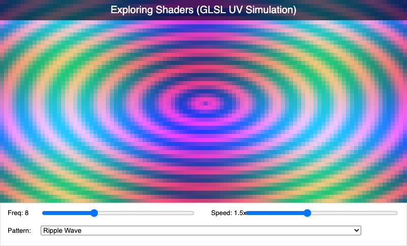

    Interactive GLSL pixel fragment shader laboratory simulating wave ripples, color gradients, and time-based uniform variables.

-   **[Flow Field Visualizer](./flow-field-visualizer/index.md)**

    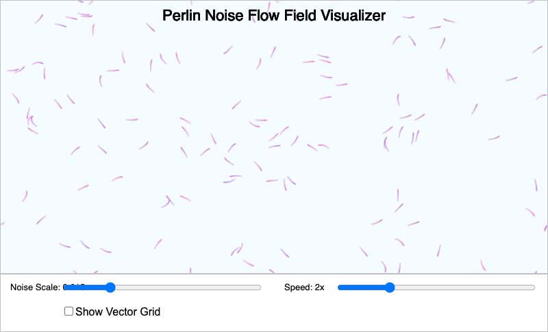

    Generate 2D Perlin noise vector flow fields with interactive particle tracers, noise scale adjustments, and trajectory trails.

-   **[Harmonic Oscillator](./harmonic-oscillator/index.md)**

    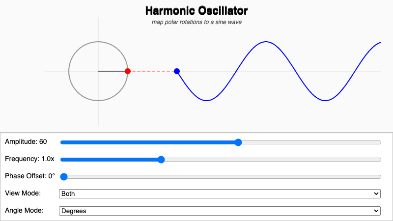

    Interactive p5.js MicroSim for harmonic oscillator.

-   **[Interactive 3D Coordinate System](./3d-coordinate-system/index.md)**

    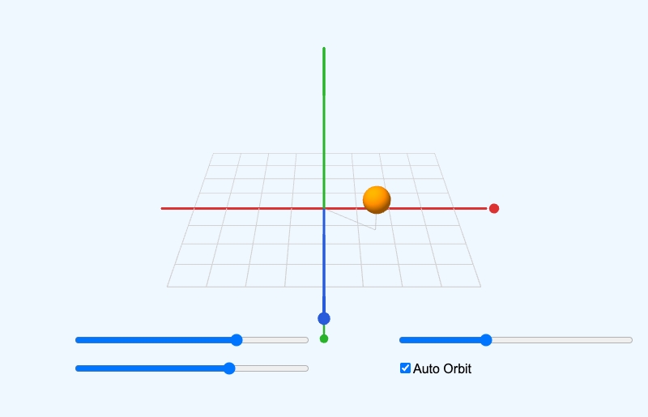

    Explore 3D WebGL Cartesian coordinates with interactive X, Y, and Z axis visualizers and coordinate readout.

-   **[Interactive Filter Studio](./interactive-filter-studio/index.md)**

    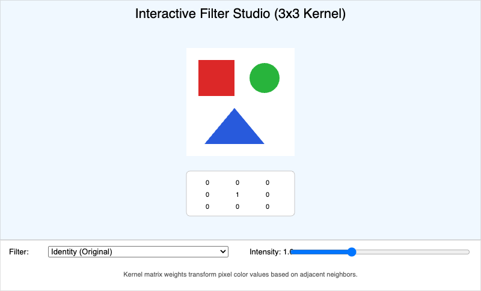

    Explore image processing 3x3 convolution kernels: Gaussian Blur, Sharpen, Ridge Edge Detection, and Emboss filters.

-   **[Interactive Filter Sweep on Noise](./interactive-filter-sweep-on-noise/index.md)**

    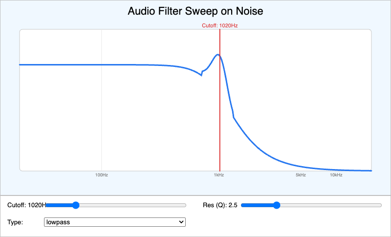

    Interactive audio filter frequency sweeper: Low-Pass, High-Pass, and Band-Pass frequency response on noise signals.

-   **[Interactive Flocking Fireworks](./interactive-flocking-fireworks/index.md)**

    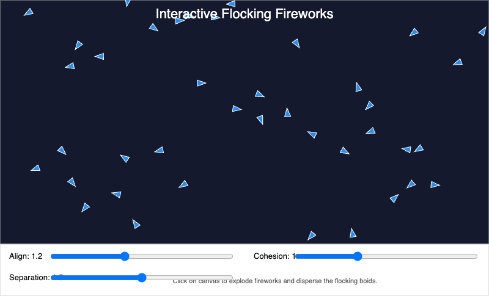

    Combine Reynolds Boids flocking rules (Separation, Alignment, Cohesion) with interactive click-triggered firework particle bursts.

-   **[Interactive Image Gallery Filter](./interactive-image-gallery-filter/index.md)**

    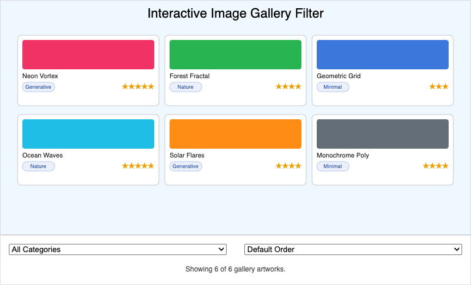

    Filter, search, and sort a responsive grid of generative artwork cards by category tags and color palettes.

-   **[Interactive Map Panning and Zooming](./interactive-map-panning-and-zooming/index.md)**

    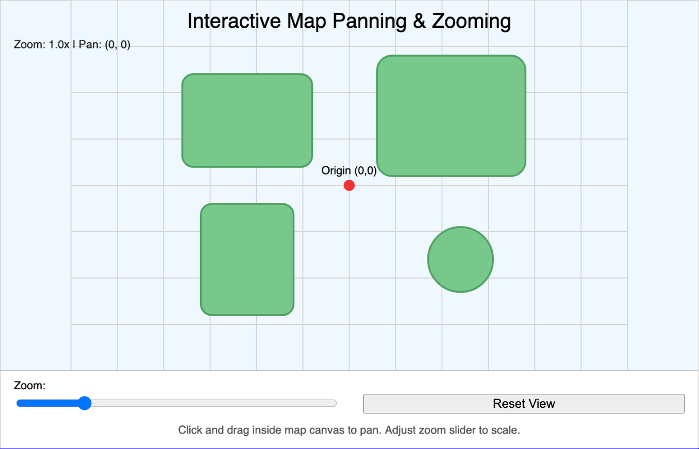

    Explore matrix transformations for 2D viewport navigation: drag to pan and slider to zoom with coordinate transformation.

-   **[Interactive Sandbox](./interactive-sandbox/index.md)**

    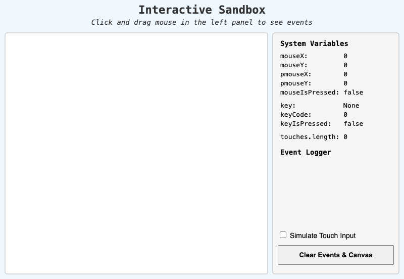

    Interactive p5.js MicroSim for interactive sandbox.

-   **[Interactive Wave Maker Laboratory](./interactive-wave-maker-laboratory/index.md)**

    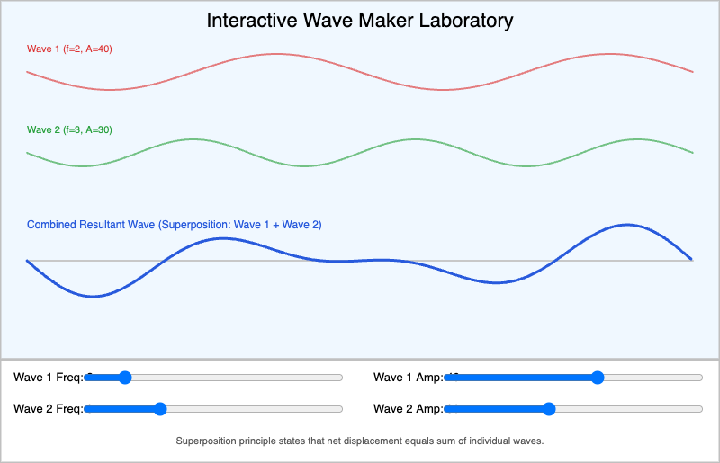

    Explore wave superposition and harmonic interference by synthesizing two traveling sine waves with adjustable amplitude, frequency, and phase.

-   **[Kinetic Text to Points](./kinetic-text-to-points/index.md)**

    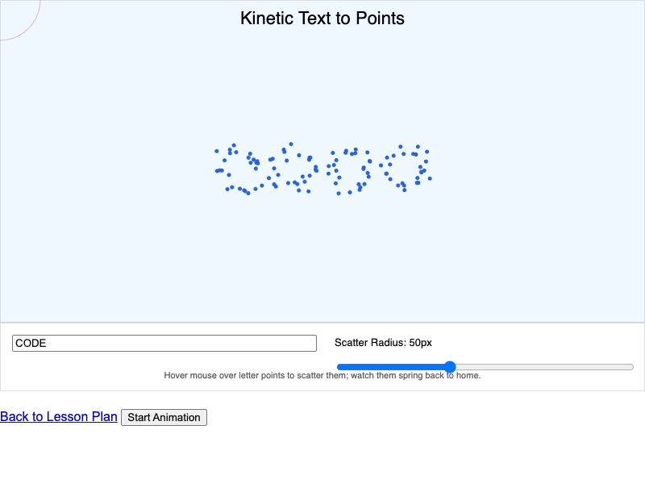

    Interactive generative typography converting letter glyph points into spring-physics particles that scatter on hover and reform.

-   **[Kinetic Typography Engine](./kinetic-typography-engine/index.md)**

    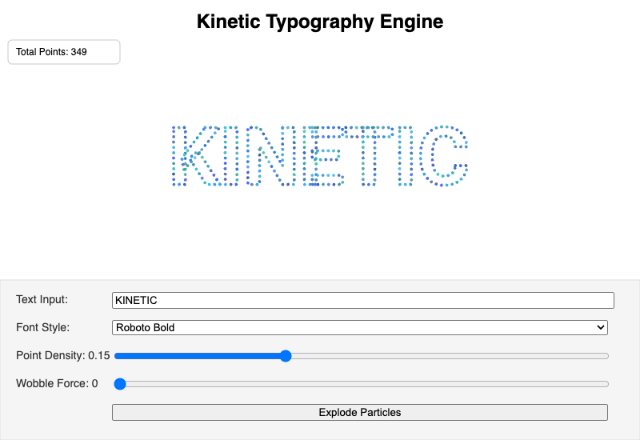

    Interactive p5.js MicroSim for kinetic typography engine.

-   **[Learning Graph Viewer](./graph-viewer/index.md)**

    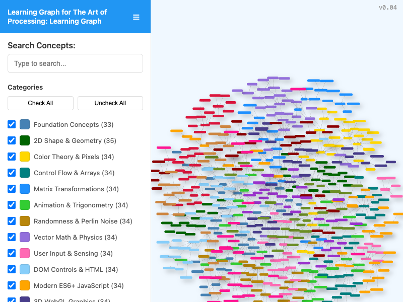

    View the learning graph and be able to search and filter by classification

-   **[Microphone Frequency Visualization with FFT](./fft-mic/index.md)**

    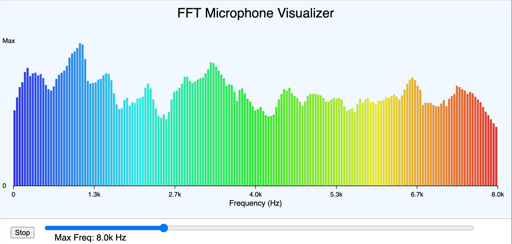

    A MicroSim that shows the frequency spectrum of sound coming in from a microphone using the p5.js fft library.

-   **[Mouse Speed Tracker](./mouse-speed-tracker/index.md)**

    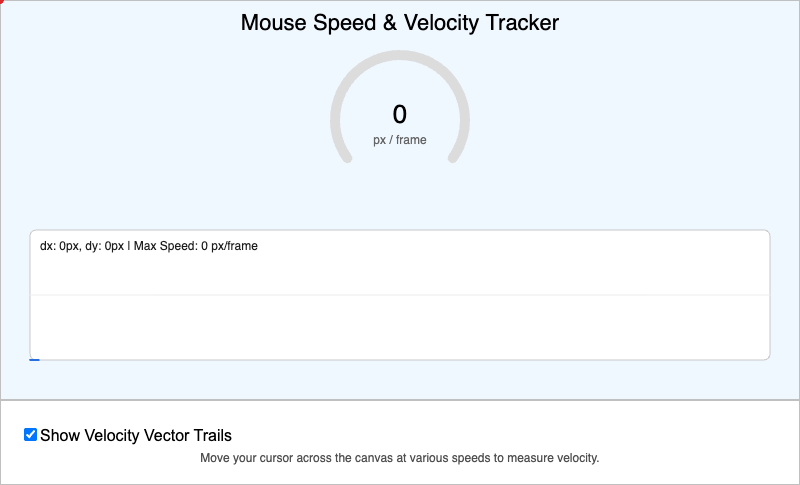

    Calculate real-time cursor velocity, acceleration, and motion vector angle using mouseX, pmouseX, and Pythagorean distance.

-   **[Multi-Touch Canvas](./multi-touch-canvas/index.md)**

    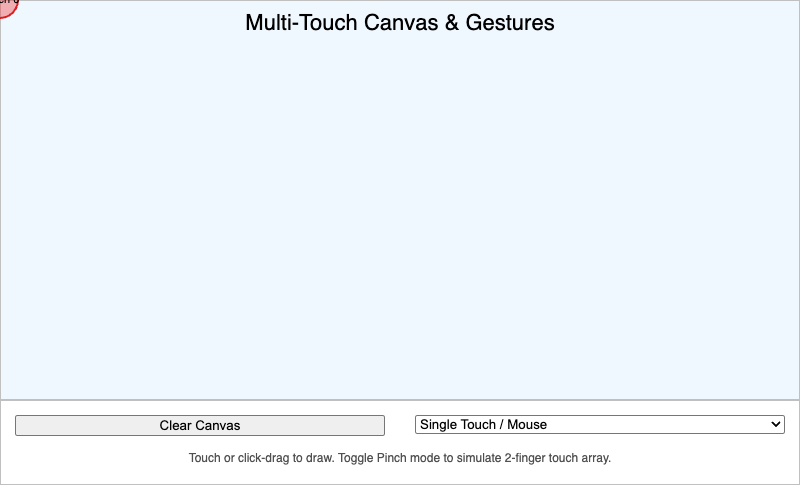

    Simulate multi-touch mobile gestures: multi-finger drawing, pinch-to-zoom distance tracking, and touch ID identification.

-   **[Nested Grid Explorer](./nested-grid-explorer/index.md)**

    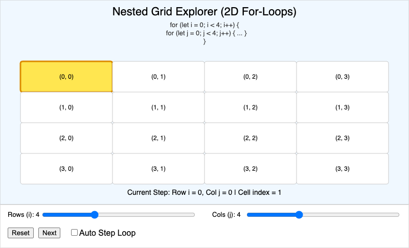

    Step through 2D nested for loops visually to understand row (i) and column (j) iteration order and cell coordinate calculation.

-   **[Orbital Mechanics Simulator](./orbital-mechanics-simulator/index.md)**

    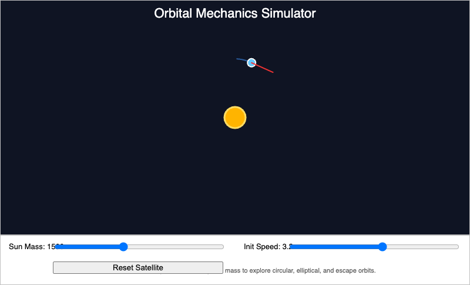

    Simulate gravitational orbital mechanics with central mass attraction, velocity vectors, elliptical orbits, and escape velocity.

-   **[Particle Physics Engine](./particle-physics-engine/index.md)**

    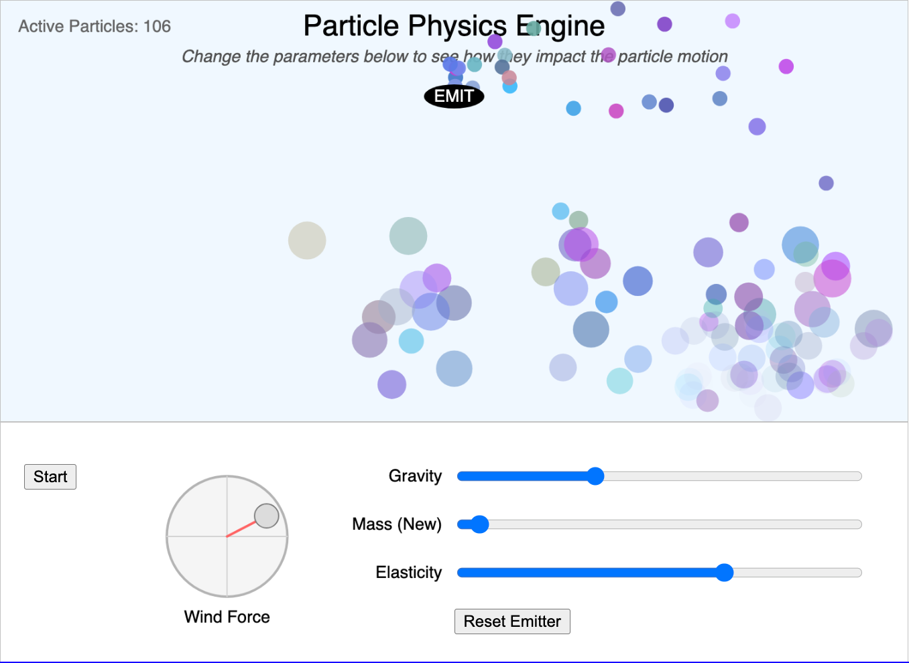

    Interactive p5.js MicroSim for particle physics engine.

-   **[Pedagogical Pattern Matcher](./pedagogical-pattern-matcher/index.md)**

    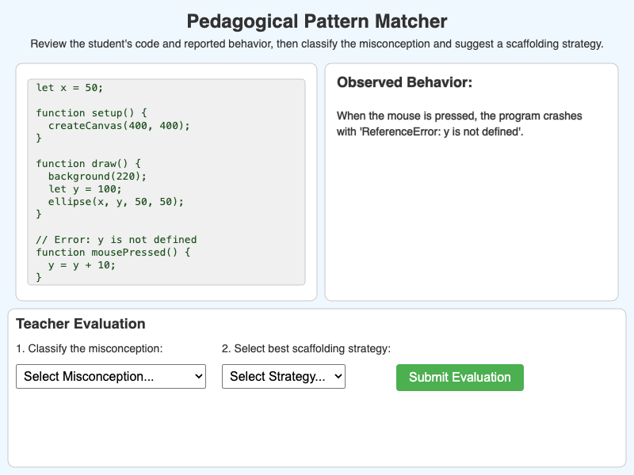

    Interactive p5.js MicroSim for pedagogical pattern matcher.

-   **[Perlin Noise Terrain Generation](./perlin-noise-terrain-generation/index.md)**

    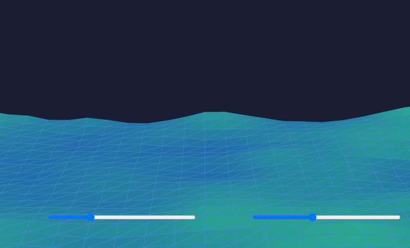

    Generate continuous organic heightmap terrain grids in 3D WebGL perspective using multi-octave 2D Perlin noise.

-   **[Pivot Point Selection](./pivot-point-selection/index.md)**

    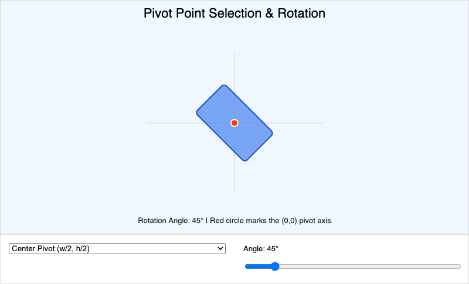

    Explore matrix transformation order (translate then rotate vs rotate then translate) and custom rotation pivot points.

-   **[Pixel Processing Pipeline](./pixel-processing-pipeline/index.md)**

    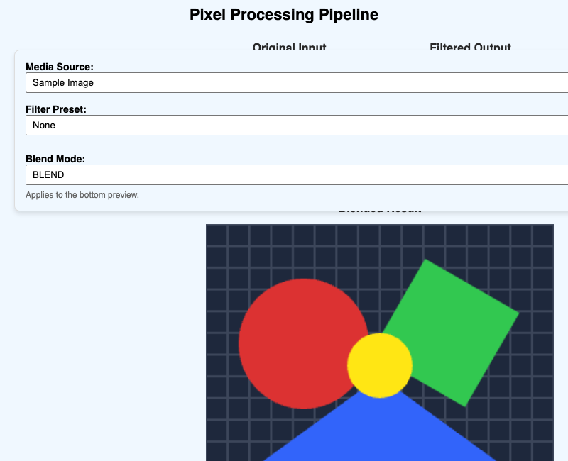

    Interactive p5.js MicroSim for pixel processing pipeline.

-   **[Polar Radar Sweeper](./polar-radar-sweeper/index.md)**

    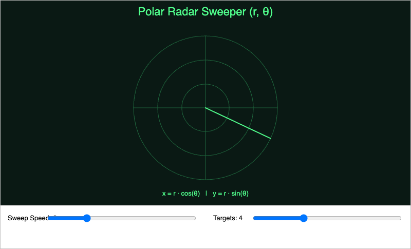

    Interactive radar sweep converting polar coordinates (radius r, angle θ) to Cartesian coordinates (x = r*cos θ, y = r*sin θ).

-   **[Random Walk Simulation](./random-walk-simulation/index.md)**

    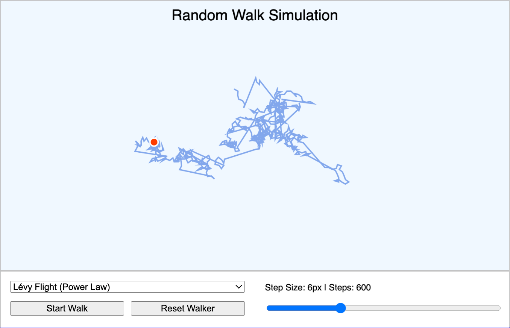

    Compare Brownian uniform random walks, Gaussian distribution walks, and Lévy Flight jumps with live spatial distribution trails.

-   **[Real-Time ASCIIfy Camera](./real-time-asciify-webcam/index.md)**

    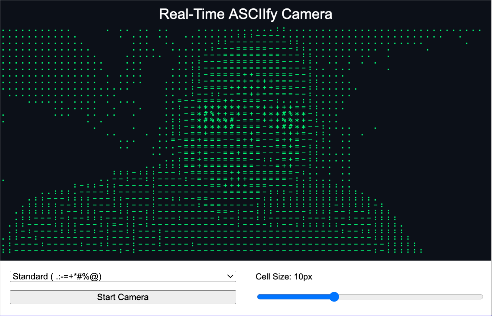

    Convert video frames or synthetic generative graphics into real-time typography ASCII character density matrix art.

-   **[Render Cycle and Frame Rate Monitor](./frame-rate-monitor/index.md)**

    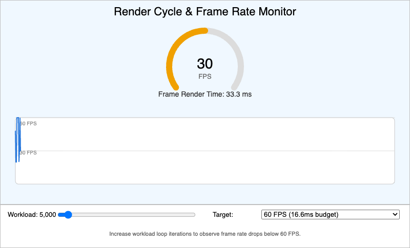

    Measure real-time frame rates (FPS), frame render time in milliseconds, and the p5.js draw() loop execution lifecycle.

-   **[Responsive Dashboard Builder](./responsive-dashboard-builder/index.md)**

    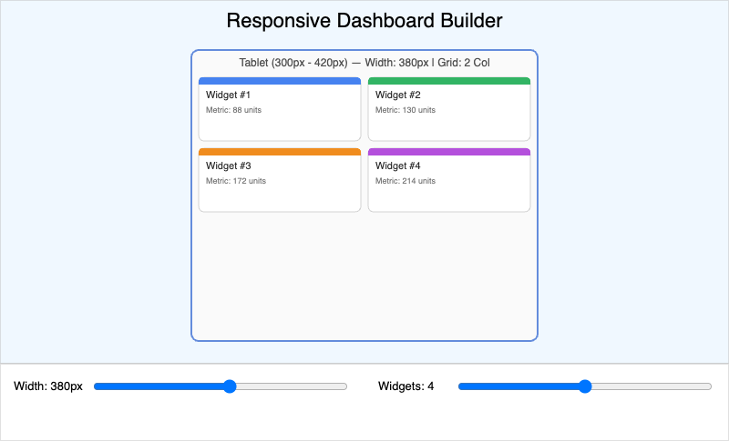

    Explore responsive UI layout patterns, breakpoint media queries, and adaptive multi-column dashboard card grids.

-   **[Robot Arm Kinematics](./robot-arm-kinematics/index.md)**

    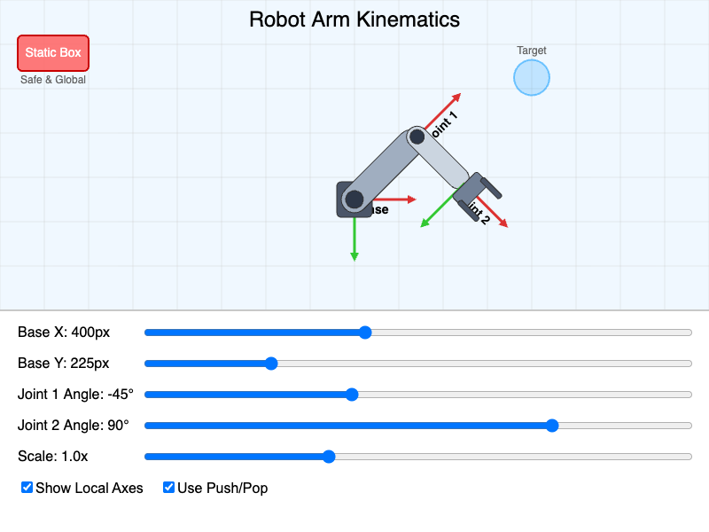

    Interactive p5.js MicroSim for robot arm kinematics.

-   **[Scope Misconception Visualizer](./scope-misconception-visualizer/index.md)**

    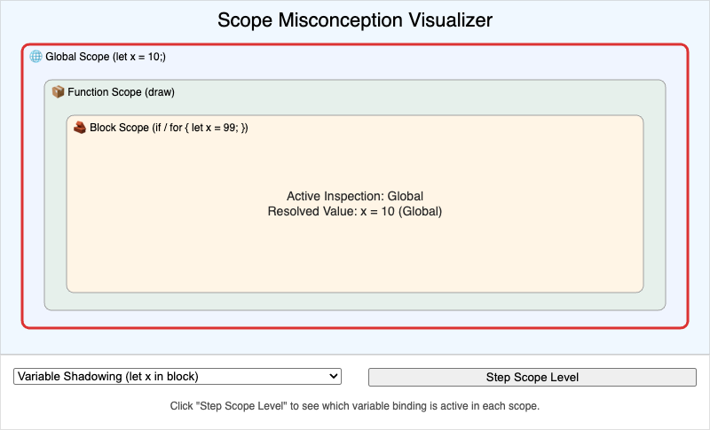

    Explore variable shadowing, temporal dead zones, and var vs let/const lexical block scoping pitfalls.

-   **[Scope Visualizer](./scope-visualizer/index.md)**

    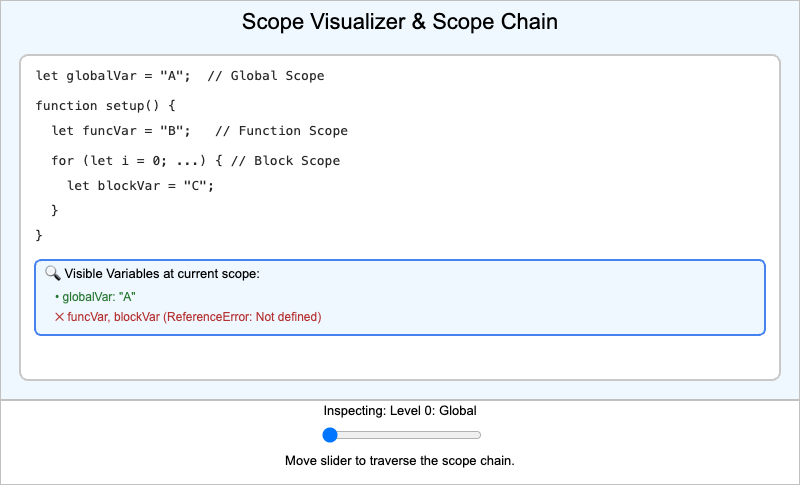

    Interactive magnifying glass revealing variable accessibility across global, function, and local block scopes.

-   **[Shape Builder](./shape-builder/index.md)**

    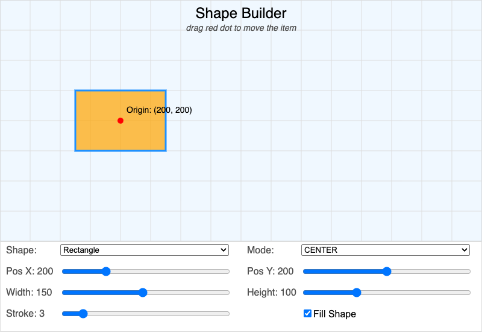

    Interactive p5.js MicroSim for shape builder.

-   **[Shape Explorer Turntable](./shape-explorer-turntable/index.md)**

    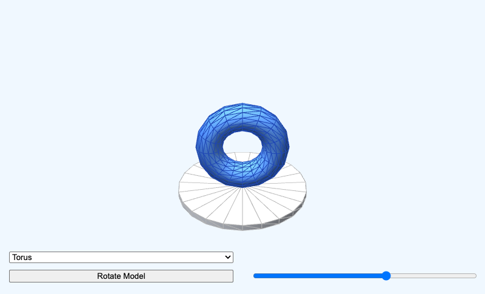

    Orbit around 3D WebGL primitive geometries on a rotating turntable: Box, Sphere, Cylinder, Cone, Torus, and Plane.

-   **[Shopping Cart Acceleration](./shopping-cart-acceleration/index.md)**

    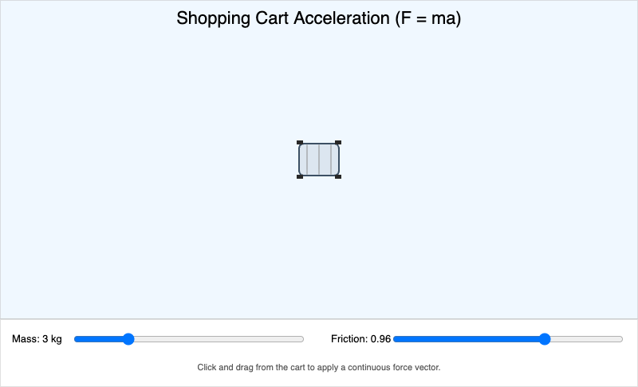

    Apply interactive force vectors to a shopping cart to visualize Newton's Second Law F = m*a, acceleration, and friction.

-   **[Spectrum Analyzer](./spectrum-analyzer/index.md)**

    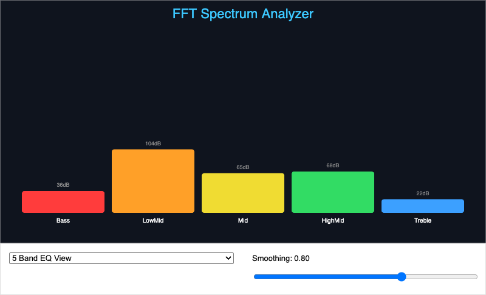

    Audio Fast Fourier Transform (FFT) spectrum visualizer displaying 5 frequency bands: Bass, LowMid, Mid, HighMid, and Treble.

-   **[Stage Lighting Setup](./stage-lighting-setup/index.md)**

    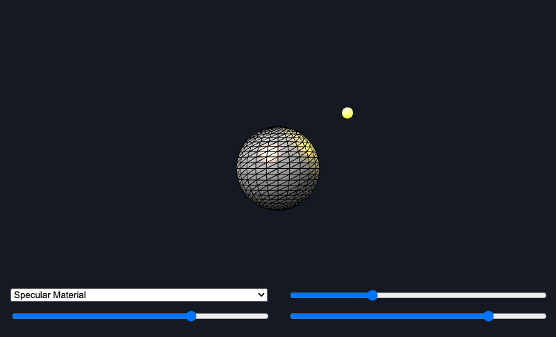

    3D WebGL stage lighting simulator: adjust Ambient, Directional, and Point light intensities on metallic, normal, and specular materials.

-   **[Stochastic L-System Tree](./stochastic-l-system-tree/index.md)**

    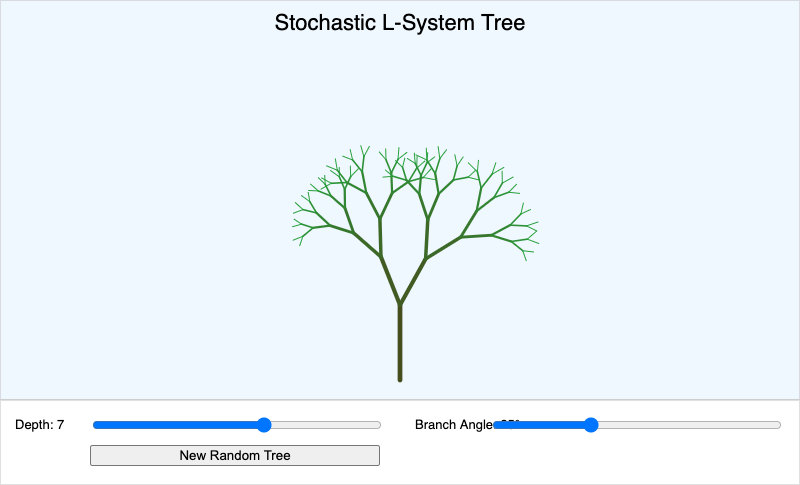

    Generate recursive branching botanical trees with stochastic random angles, depth recursion, and wind oscillation.

-   **[Synthesizer Board](./synthesizer-board/index.md)**

    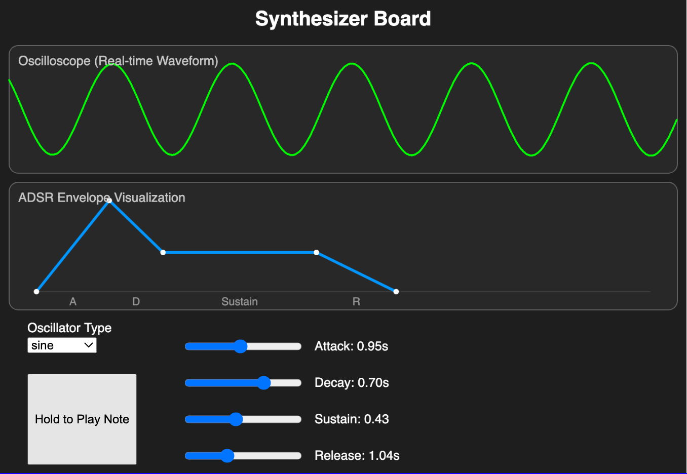

    Interactive p5.js MicroSim for synthesizer board.

-   **[Terrain Generator](./terrain-generator/index.md)**

    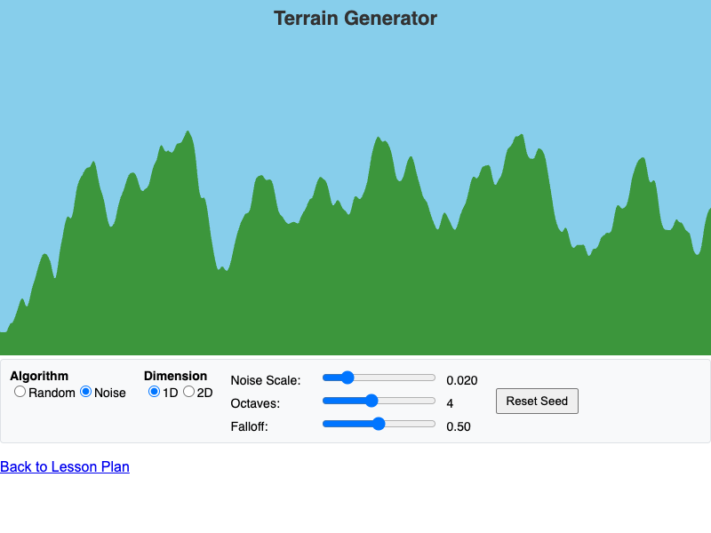

    Interactive p5.js MicroSim for terrain generator.

-   **[Text Formatting Basics](./text-formatting-basics/index.md)**

    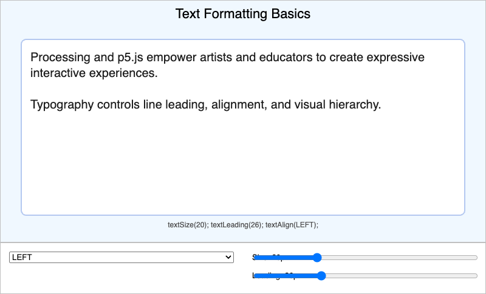

    Interactive typography styling: explore textSize, textLeading line spacing, textAlign horizontal/vertical anchors, and text bounds.

-   **[The Callback Kitchen](./the-callback-kitchen/index.md)**

    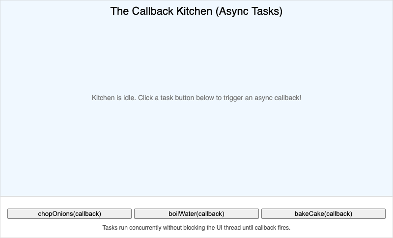

    Interactive kitchen simulation explaining asynchronous callback functions, event listeners, and non-blocking execution.

-   **[The Color Compass](./the-color-compass/index.md)**

    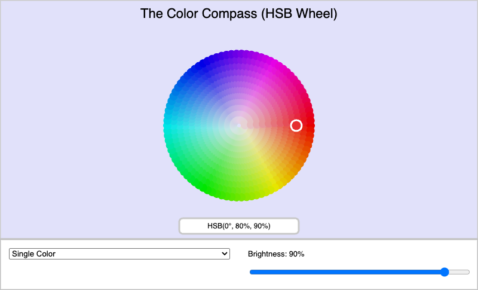

    Navigate HSB (Hue, Saturation, Brightness) color space with an interactive circular chromatic wheel and harmony markers.

-   **[The Generative Art Mixing Desk](./the-generative-art-mixing-desk/index.md)**

    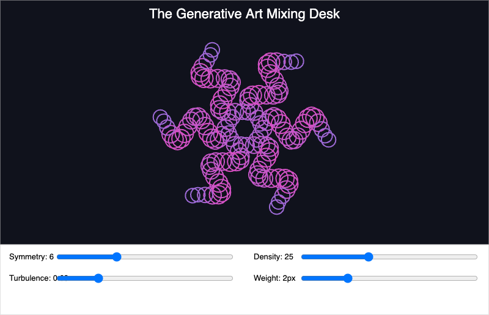

    Mixing console controlling generative visual parameters: symmetry, density, noise turbulence, color palette, and line weight.

-   **[The Great Easing Race](./the-great-easing-race/index.md)**

    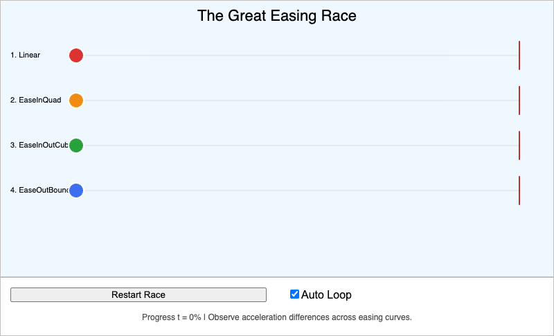

    Race 4 easing functions side-by-side: Linear, EaseInQuad, EaseOutBounce, and EaseInOutCubic across synchronized tracks.

-   **[The Interactive Array Train](./the-interactive-array-train/index.md)**

    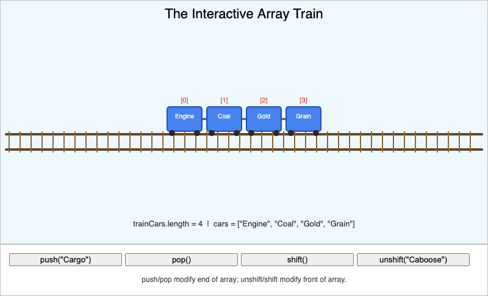

    Visualize array mutator operations (push, pop, shift, unshift, splice) as train cars on a railway track with index indicators.

-   **[The Logic Gate Switchboard](./the-logic-gate-switchboard/index.md)**

    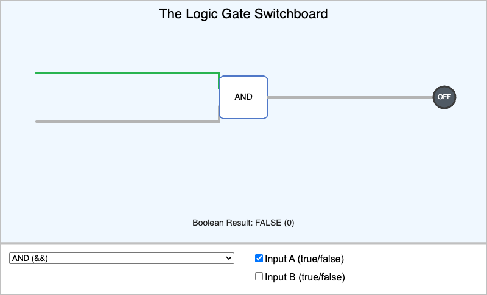

    Wire up boolean logic gate switches (AND, OR, NOT, XOR, NAND) to route signals to a neon indicator sign.

-   **[The Magnifying Glass Array Translator](./the-magnifying-glass-array-translator/index.md)**

    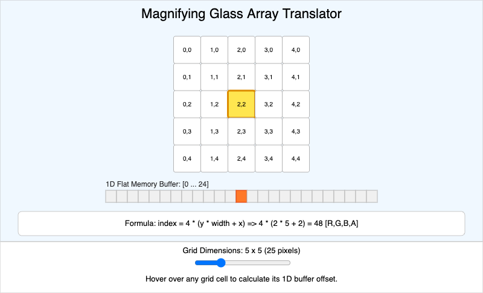

    Translate 2D pixel coordinates (x, y) into 1D flat memory indices index = 4*(y*width + x) for pixels[] manipulation.

-   **[The Object Factory](./the-object-factory/index.md)**

    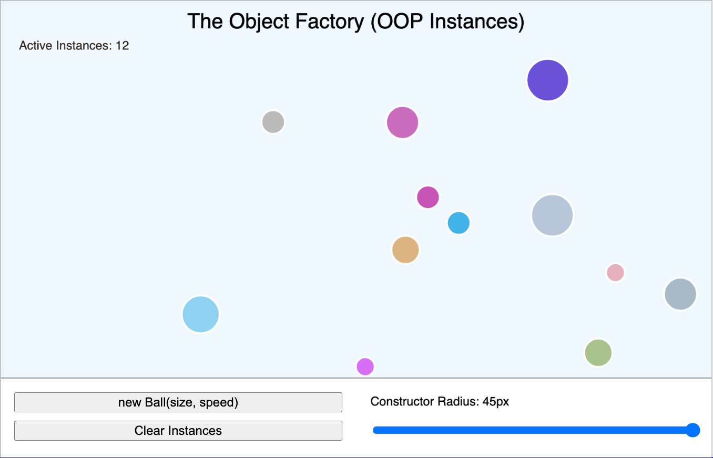

    OOP Class instantiation simulator: spawn autonomous object instances with custom properties, methods, and constructor parameters.

-   **[The Solar System Hierarchy](./the-solar-system-hierarchy/index.md)**

    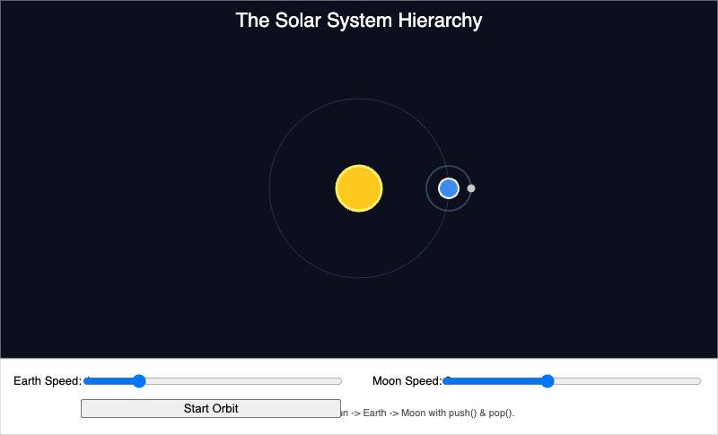

    Explore hierarchical matrix transformations with nested push(), translate(), rotate(), and pop() stacks (Sun -> Earth -> Moon).

-   **[UI Component Playground](./ui-component-playground/index.md)**

    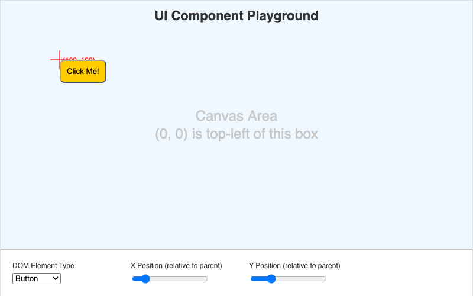

    Interactive p5.js MicroSim for ui component playground.

-   **[Vector Dot Product Visualizer](./vector-dot-product-visualizer/index.md)**

    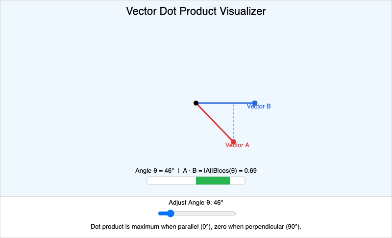

    Rotate vector A relative to vector B to compute the dot product A · B = |A||B|cos(θ) with scalar projection and geometric angle readouts.

-   **[Water Hose Particle Emitter](./water-hose-particle-emitter/index.md)**

    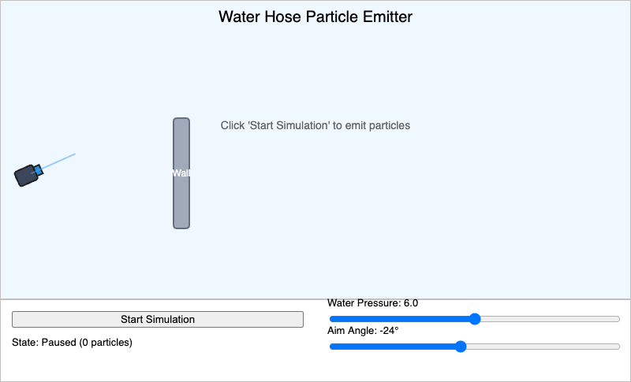

    Draggable continuous water nozzle particle emitter simulating lifespan, gravity, and elastic barrier collisions.

-   **[Waveform Visualizer & Hearer](./waveform-visualizer-hearer/index.md)**

    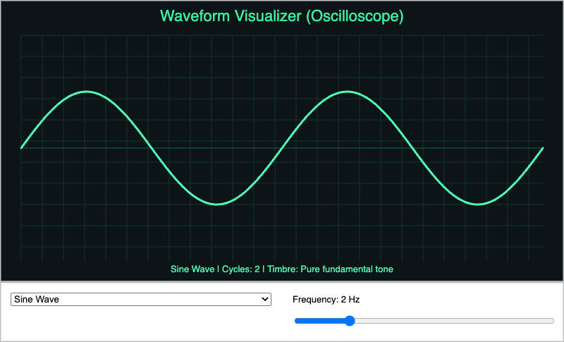

    Oscilloscope visualizing the 4 fundamental audio synthesizer waveforms: Sine, Square, Triangle, and Sawtooth with frequency controls.

